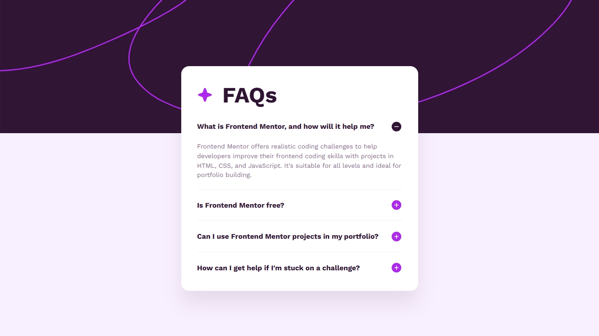

# Frontend Mentor - FAQ accordion solution

This is a solution to the [FAQ accordion challenge on Frontend Mentor](https://www.frontendmentor.io/challenges/faq-accordion-wyfFdeBwBz). Frontend Mentor challenges help you improve your coding skills by building realistic projects. 

## Table of contents

- [Overview](#overview)
  - [The challenge](#the-challenge)
  - [Screenshot](#screenshot)
  - [Links](#links)
- [My process](#my-process)
  - [Built with](#built-with)
  - [What I learned](#what-i-learned)
  - [Continued development](#continued-development)


## Overview

### The challenge

Users should be able to:

- Hide/Show the answer to a question when the question is clicked
- Navigate the questions and hide/show answers using keyboard navigation alone
- View the optimal layout for the interface depending on their device's screen size
- See hover and focus states for all interactive elements on the page

### Screenshot




### Links

- Solution URL: [Add solution URL here](https://github.com/Yahyaball/faq-accordion-main)
- Live Site URL: [Add live site URL here](https://yahyaball.github.io/faq-accordion-main/)

## My process

### Built with

- Semantic HTML5 markup
- CSS custom properties
- Flexbox
- Pure JS


### What I learned

I have learned about the forEach function that allows you to make all buttons clickable with the addEventListener click function, so all elements are interactable to show and hide answers, and also for the keydown function so it can be interactable with keyboard keys. It gave me a headache the first time I tried to code with JavaScript.

These are the snippets that I use to make the website interactive:
```
const qna = document.querySelectorAll(".qna");

qna.forEach((q) => {
  const button = q.querySelector(".question");
  const answer = q.querySelector(".answer");
  let buttonIcon = button.querySelector(".button-icon");
  button.addEventListener("click", () => {
    if (answer.classList.contains('show')) {
        answer.classList.remove('show');
        answer.classList.add('hide');
        buttonIcon.setAttribute('src', 'assets/images/icon-plus.svg')

    } else {
        answer.classList.remove('hide');
        answer.classList.add('show');
        buttonIcon.setAttribute('src', 'assets/images/icon-minus.svg')
    }
  });
  button.addEventListener("keydown", function(event) {
      if (event.key === "Enter") {
    event.preventDefault();
        if (answer.classList.contains('show')) {
        answer.classList.remove('show');
        answer.classList.add('hide');
        buttonIcon.setAttribute('src', 'assets/images/icon-plus.svg')

    } else {
        answer.classList.remove('hide');
        answer.classList.add('show');
        buttonIcon.setAttribute('src', 'assets/images/icon-minus.svg')
    }
  }
  })
});
```

### Continued development

If I want to continue my JavaScript development journey, I need to learn more JavaScript functions so my code will work on my projects.